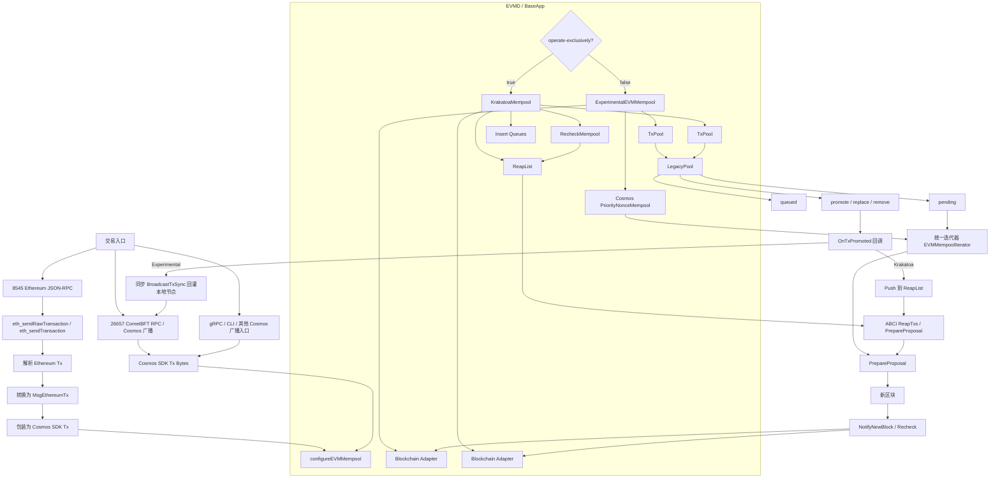
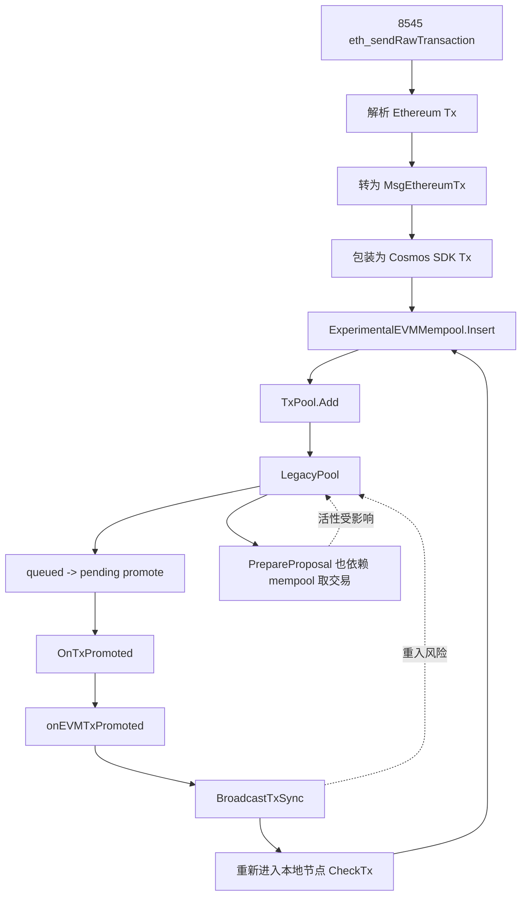

# Cosmos EVM Mempool 实现详解

## 1. 文档目的

本文面向当前仓库，详细说明 mempool 在工程上的实现方式，重点回答下面几个问题：

- 应用启动时到底会创建哪一种 mempool
- EVM 交易和 Cosmos 交易分别怎么进池、怎么出池
- 为什么仓库里同时存在 `ExperimentalEVMMempool` 和 `KrakatoaMempool`
- `LegacyPool`、`TxPool`、`Blockchain`、`RecheckMempool`、`ReapList` 分别负责什么
- `CheckTx`、`PrepareProposal`、`InsertTx`、`ReapTxs` 之间是什么关系
- 当前实现里哪些地方最值得关注，尤其是活性、重入和调试问题

这不是对 `mempool/README.md` 的简单翻译，而是基于当前代码结构做的一份中文实现说明。

## 2. 总体结构

当前项目的 mempool 不是单一数据结构，而是一组协作组件。

从高层看，可以把它分成三层：

1. 应用接线层
   - 位于 `evmd/mempool.go`
   - 决定应用启动时使用哪一种 mempool 实现
2. 交易管理层
   - 位于 `mempool/`
   - 负责 EVM 交易、Cosmos 交易的插入、排序、移除、重检和选块
3. EVM 子池层
   - 位于 `mempool/txpool/`，尤其是 `legacypool`
   - 负责 EVM nonce、pending/queued、替换交易、base fee、优先级等逻辑

当前项目实际支持两种 app-side mempool 模式：

- `ExperimentalEVMMempool`
  - 非独占模式
  - 仍与 CometBFT 自己的 mempool 共存
- `KrakatoaMempool`
  - 独占模式
  - 与 CometBFT 的 `app` mempool 配合
  - 使用 `InsertTx` / `ReapTxs` 这类应用侧接口

下面这张图给出整体架构总览：

## 3. 启动时如何选择 mempool

应用启动入口在 `evmd/mempool.go` 的 `configureEVMMempool(...)`。

选择逻辑可以概括成三步。

### 3.1 先判断是否启用 EVM mempool

只有在下面两个前提都满足时，应用才会继续初始化 mempool：

1. EVM chain config 已存在
2. `mempool.max-txs >= 0`

如果 `mempool.max-txs < 0`，代码会直接跳过 mempool 初始化。

这意味着：

- `mempool.max-txs = -1`
  - app-side mempool 关闭
- `mempool.max-txs = 0`
  - app-side mempool 打开，且不限制数量
- `mempool.max-txs > 0`
  - app-side mempool 打开，且有容量限制

### 3.2 再看是否独占运行

如果 `evm.mempool.operate-exclusively=true`，走：

- `KrakatoaMempool`

否则走：

- `ExperimentalEVMMempool`

所以这两个开关组合非常关键：

- `mempool.max-txs`
  决定 app-side mempool 是否被启用
- `evm.mempool.operate-exclusively`
  决定启用后选哪一种实现

### 3.3 两条分支的接线差异

#### ExperimentalEVMMempool

应用会：

- `SetCheckTxHandler(...)`
- `SetPrepareProposal(...)`
- `SetMempool(evmMempool)`

这条路径仍以常规 `CheckTx` 和 `PrepareProposal` 为主。

#### KrakatoaMempool

应用会：

- `SetInsertTxHandler(...)`
- `SetReapTxsHandler(...)`
- `SetPrepareProposal(...)`
- `SetMempool(krakatoaMempool)`

这条路径依赖 CometBFT 的 `app` mempool 工作模式。

### 3.4 CometBFT mempool 和 app mempool 到底有什么区别

这两个名字看起来很像，但它们处在两层完全不同的体系里。

可以先用一句话区分：

- `CometBFT mempool`
  - 更偏网络层和共识层
  - 解决的是“交易怎么进入节点、怎么传播、共识怎么拿到候选交易”
- `app mempool`
  - 更偏应用层
  - 解决的是“交易在应用内部怎么校验、排队、重检、排序、供 proposer 选块”

在当前仓库里，`app mempool` 是挂在 `BaseApp` 上的真实实现，而不是一个抽象概念。

对应代码在：

- `evmd/mempool.go`
- `mempool/mempool.go`
- `mempool/krakatoa_mempool.go`

如果按职责拆开看，两者的差别主要有下面几类。

#### 交易语义理解能力不同

`CometBFT mempool` 更关心的是交易的接收和共识流程本身。

它并不原生理解：

- EVM nonce gap
- `queued` 和 `pending` 的区别
- EVM 交易替换
- base fee 变化后哪些交易该保留、哪些该降级

而 `app mempool` 明确理解这些应用语义。

例如在当前仓库里：

- EVM 交易会进入 `TxPool/LegacyPool`
- 普通 Cosmos 交易会进入 `PriorityNonceMempool` 或 `RecheckMempool`

这就是为什么 app mempool 能支持以太坊常见的“先收到 nonce 11，再收到 nonce 10”这种场景，而传统 Cosmos 路径通常做不到。

#### 数据结构不同

`CometBFT mempool` 更像共识层的候选交易池。

而 `app mempool` 在当前项目里其实是一组组件：

- `ExperimentalEVMMempool`
  - 内部组合了 `txPool`、`legacyTxPool`、`cosmosPool`
- `KrakatoaMempool`
  - 在此基础上还增加了 `RecheckMempool`、`ReapList`、`insert queue`

所以 app mempool 并不是“换个名字的同一个池”，而是一套应用级交易调度系统。

#### 出块前谁真正决定候选交易不同

`CometBFT mempool` 传统上负责为 proposer 提供候选交易。

但在这个仓库里，应用会显式设置：

- `SetPrepareProposal(...)`
- 在独占模式下还会设置 `SetInsertTxHandler(...)` 和 `SetReapTxsHandler(...)`

这意味着：

- 即使共识层还在参与交易接收
- 真正“当前哪些交易可被打进块、顺序如何”这件事
- 已经越来越由 app mempool 主导

#### 重检方式不同

`CometBFT mempool` 的重检更偏共识流程通用语义。

而 `app mempool` 的重检会显式结合：

- EVM nonce
- 账户余额
- base fee
- 当前块高
- Cosmos 状态变化

特别是在 `KrakatoaMempool` 里，Cosmos 交易还有独立的 `RecheckMempool`。

#### 和客户端入口的关系不同

对外看，用户常接触的是：

- `26657`
- `8545`
- CLI
- gRPC

但这些都只是入口。

真正进入节点以后，交易是否会变成：

- 走传统广播路径
- 进入 `LegacyPool`
- 进入 `ReapList`
- 进入 `cosmosPool`

是由 app mempool 决定的。

所以最不容易混淆的记法是：

- `CometBFT mempool`
  - 负责“交易怎么进网络、怎么进入共识流程”
- `app mempool`
  - 负责“交易在应用里怎么活着、何时可执行、如何进入区块”

### 3.5 `mempool.type = "app"` 到底意味着什么

这个配置非常容易被误解。

你可以先把结论记成：

- `mempool.type = "app"`
  - 不是说 CometBFT 从此完全不管交易
  - 而是说 CometBFT 不再维护传统那套共识侧 mempool 语义
  - 交易的接收与供块，改为通过应用侧 handler 来完成

在当前仓库里，这件事会和 `KrakatoaMempool` 绑定起来。

当：

- `mempool.max-txs >= 0`
- `evm.mempool.operate-exclusively=true`
- CometBFT `config.toml` 里 `mempool.type = "app"`

应用会注册：

- `SetInsertTxHandler(...)`
- `SetReapTxsHandler(...)`

也就是：

- CometBFT 在收到交易后，不再按传统方式自己长期维护那套普通 mempool
- 它会通过 `InsertTx` 把交易交给应用
- 当 proposer 需要交易时，再通过 `ReapTxs` 向应用要一批可打包交易

所以你刚才那句理解，大方向是对的：

- 是的，`type = "app"` 的核心含义就是出块时直接找 app 侧 mempool 拿交易

但更精确一点的说法应该是：

- 不是“CometBFT 完全不再存储任何交易”
- 而是“CometBFT 不再使用传统那套默认 mempool 作为主交易池”
- 交易的收纳、重检、可执行性判断、reap 结果生成，改由 app mempool 主导

可以把它想象成一次职责转移：

1. 传统模式
   - CometBFT 自己维护主要交易池
   - app 主要在 `CheckTx/PrepareProposal` 阶段参与
2. `type = "app"` 模式
   - CometBFT 仍然负责共识流程和与应用通信
   - 但真正的交易池逻辑下沉到应用
   - proposer 需要交易时直接向应用请求

在当前仓库里，`KrakatoaMempool` 就是为这种模式准备的。

它的几个直接特征是：

- 新交易进入时走 `InsertTx`
- EVM 交易 promoted 后不再 `BroadcastTxSync`
- 而是直接进入 `ReapList`
- proposer 组块时通过 `ReapTxs` 从 `ReapList` 和 recheck 后的 Cosmos 候选中取交易

所以一句话总结：

- `mempool.type = "app"` 不是“CometBFT 消失了”
- 而是“CometBFT 把 mempool 主体职责让给了应用”

### 3.6 `mempool.max-txs = -1` 时，交易是怎么被检查的

很多人第一次看到这个开关时，会以为：

- `mempool.max-txs = -1`
  - 表示节点不再做交易校验

这其实是不对的。

更准确的含义是：

- `mempool.max-txs < 0`
  - app-side mempool 不初始化
  - 也就不会启用这套 EVM app mempool 的特殊接线逻辑

但交易本身仍然会被正常检查。

这时大致链路是：

1. 客户端把交易发给节点
2. CometBFT 把交易交给应用执行 `CheckTx`
3. 应用走默认的 `CheckTx` 流程
4. 其中仍然会执行 ante handler

所以：

- 签名检查还在
- 手续费检查还在
- 余额检查还在
- sequence/nonce 检查还在

真正消失的是：

- `ExperimentalEVMMempool`
- `KrakatoaMempool`
- EVM nonce gap 的本地排队能力
- app mempool 相关的 `CheckTxHandler` / `InsertTxHandler` / `ReapTxsHandler`

换句话说：

- `mempool.max-txs = -1`
  - 不是“不做 CheckTx”
  - 而是“只走默认 CheckTx/Ante，不再走 app-side mempool 的特殊处理”

这也解释了为什么在这种模式下，超前 nonce 交易往往会直接报错，而不会被节点本地缓存等待。

### 3.7 开启 app-side mempool 后，还会不会做 `CheckTx` 和 `Ante`

会，但要区分是非独占模式还是独占模式。

#### 非独占模式：`ExperimentalEVMMempool`

在这个模式下，应用会注册自定义 `CheckTxHandler`。

所以实际流程是：

1. 交易先照常进入 `CheckTx`
2. 仍然会跑 `runTx`
3. 也就是仍然会经过 ante handler
4. 如果是普通错误，就按普通错误返回
5. 如果是 EVM nonce gap 这类特殊错误，就不是简单拒绝，而是转进 app mempool 做本地排队

因此：

- `CheckTx/Ante` 仍然存在
- 只是超前 nonce 不再被简单当场拒绝
- 而是被自定义 `CheckTxHandler` 接住后，转进本地 EVM 池

这也是为什么在 `ExperimentalEVMMempool` 模式下，客户端会感觉“超前 nonce 交易也被接受了”。

其实更准确地说是：

- 它先被 `CheckTx` 判出 nonce gap
- 然后又被自定义逻辑转存到了本地池里

#### 独占模式：`KrakatoaMempool`

在独占模式下，应用不再依赖 `Experimental` 那条自定义 `CheckTx` 主路径来接收 EVM 交易。

这里的主流程变成：

- 新交易通过 `InsertTx` 进入应用
- proposer 通过 `ReapTxs` 向应用要交易

所以 EVM 交易不会先走那条“老式 `CheckTx` 遇到 nonce gap 就报错”的主路径。

但这不等于完全不做校验。

只是校验位置发生了变化：

- Cosmos 交易在插入 `RecheckMempool` 时仍然会做 ante 校验
- EVM 和 Cosmos 交易在后续 recheck 阶段，仍然会通过 rechecker 调用 ante handler

所以独占模式更准确的理解是：

- 不是“不做 `CheckTx/Ante`”
- 而是“不再依赖传统 `CheckTx` 作为 EVM 交易的主接收入口”
- 校验改为在 app mempool 插入和 recheck 阶段完成

一句话总结这两种模式：

- `ExperimentalEVMMempool`
  - 先 `CheckTx/Ante`
  - 再把超前 nonce 交易兜底放进本地池
- `KrakatoaMempool`
  - 不依赖传统 `CheckTx` 作为 EVM 主入口
  - 交易直接进入 app mempool，再由应用侧完成校验与 recheck

## 4. 为什么需要两种 mempool

### 4.1 ExperimentalEVMMempool 的目标

它的目标是：

- 尽量兼容 Cosmos SDK / CometBFT 现有流程
- 在不完全改造共识侧接口的前提下
- 给 EVM 交易增加“本地排队 + nonce gap 容忍 + 费用优先级”能力

你可以把它理解成：

- EVM 交易先在应用内部做一次以太坊式管理
- 真正可以执行的交易，再广播回网络或暴露给提案路径

这条路径兼容性强，但架构上更复杂，因为它处于“应用 mempool”和“CometBFT mempool”并存的过渡状态。

### 4.2 KrakatoaMempool 的目标

它的目标是：

- 让应用侧 mempool 成为唯一可信的交易来源
- 由应用自己决定如何接收交易、如何重检、如何 reaping、如何喂给 proposer
- 避免传统非独占路径中的重复广播、重复检查和部分重入风险

这条路径更彻底，但也更依赖 CometBFT 的 `type = "app"` 配置和应用侧 handler。

### 4.3 用一个具体例子看两者差别

下面用一个具体例子说明两种模式的功能差别。

假设当前链上：

- 账户 `A` 的已提交 nonce 是 `10`
- 用户通过 `8545` 连续发送两笔 EVM 交易：
  - `tx11`，nonce = `11`
  - `tx10`，nonce = `10`

也就是先发了后序交易，再发前序交易。

这正是 Ethereum 工具里很常见的场景，例如：

- Foundry 批量发送
- 部署脚本并发发交易
- 本地脚本一次性签好一批连续 nonce 的交易后乱序到达节点

#### 在 ExperimentalEVMMempool 里会发生什么

第一阶段，`tx11` 先到：

1. `8545` 收到 `tx11`
2. 节点把它转成 `MsgEthereumTx`
3. 再包装成 Cosmos tx
4. `ExperimentalEVMMempool.Insert(...)` 把它交给 `LegacyPool`
5. 因为 nonce `11` 前面还缺 `10`，所以 `tx11` 进入 `queued`

第二阶段，`tx10` 后到：

1. `8545` 收到 `tx10`
2. 同样转成 `MsgEthereumTx`
3. 进入 `ExperimentalEVMMempool.Insert(...)`
4. `LegacyPool` 发现 `tx10` 现在可以执行，于是把 `tx10` 放进 `pending`
5. 同时因为 `10` 这个 gap 被补上了，之前的 `tx11` 也会从 `queued` 被 promoted 到 `pending`

重点在 promoted 之后：

6. `LegacyPool.OnTxPromoted` 被触发
7. `ExperimentalEVMMempool.onEVMTxPromoted(...)` 会同步执行 `BroadcastTxSync`
8. promoted 的交易会重新作为 Cosmos tx 广播回本地节点 / CometBFT 路径

所以在 `ExperimentalEVMMempool` 里，成熟交易的传播方式是：

- 先在本地 EVM 池里排队
- 成熟后再同步广播出去

这是它最重要的功能特点。

#### 在 KrakatoaMempool 里会发生什么

还是同样的两笔交易：

- `tx11` 先到
- `tx10` 后到

前半段与 Experimental 模式相似：

1. 两笔交易都会进入 `LegacyPool`
2. `tx11` 先进入 `queued`
3. `tx10` 到来后，`tx10` 进入 `pending`
4. `tx11` 被 promoted 到 `pending`

但是 promoted 之后的动作完全不同：

5. `LegacyPool.OnTxPromoted` 被触发
6. `KrakatoaMempool.onEVMTxPromoted()` 不会调用 `BroadcastTxSync`
7. 它只会把这笔交易放进 `ReapList`
8. 当 proposer 需要打包新区块时，应用通过 `ReapTxs` / `PrepareProposal` 直接从 `ReapList` 取出这些已验证的交易

所以在 `KrakatoaMempool` 里，成熟交易的传播方式是：

- 先在本地 EVM 池里排队
- 成熟后直接进入应用自己的候选交易集合
- 不再通过同步广播回灌本地节点

#### 两者最核心的功能差别

用同一个例子看，本质区别不是“能不能处理 nonce gap”，因为两者都能。

真正的差别是“交易成熟后，接下来怎么流转”：

- `ExperimentalEVMMempool`
  - 成熟后同步广播
  - 仍然依赖传统广播链路把交易送进后续流程
  - 更像“本地排队 + 成熟后重新走一次网络入口”

- `KrakatoaMempool`
  - 成熟后直接进入 `ReapList`
  - 由应用自己喂给 proposer
  - 更像“本地排队 + 成熟后直接交给出块流程”

#### 再举一个 Cosmos 交易混合场景

假设此时还有一笔普通 Cosmos `bank send` 交易 `cosmosTx1`。

在两种模式下，它们都会和 EVM 交易一起竞争出块，但方式也有差别：

- 在 `ExperimentalEVMMempool` 中：
- `cosmosTx1` 会进入 `cosmosPool`
  - `tx10` / `tx11` 在 promoted 后会走广播路径
  - 最终 `EVMMempoolIterator` 会统一比较 EVM 和 Cosmos 候选的优先级

- 在 `KrakatoaMempool` 中：
- `cosmosTx1` 会进入 `RecheckMempool`
  - 如果检查通过，会被加入 `ReapList`
  - `tx10` / `tx11` promoted 后也直接进 `ReapList`
  - proposer 从应用侧直接取出“当前已经有效”的 EVM/Cosmos 混合交易集合

所以再换一句更工程化的话来总结：

- `ExperimentalEVMMempool` 解决的是“如何让 EVM 交易在现有 Cosmos/Comet 流程里尽量兼容 Ethereum 语义”
- `KrakatoaMempool` 解决的是“如何让应用自己完整接管交易进入区块的过程”

## 5. 共享底层组件

无论是 `ExperimentalEVMMempool` 还是 `KrakatoaMempool`，底层都不是从零开始自己维护所有状态，它们共享几类核心组件。

### 5.1 Blockchain

`mempool/blockchain.go` 提供了一个把 Cosmos 状态桥接成 go-ethereum txpool 所需接口的适配层。

它的职责包括：

- 提供当前区块头 `CurrentBlock()`
- 提供状态访问 `StateAt(hash)`
- 提供链头事件订阅 `SubscribeChainHeadEvent(...)`
- 在新区块提交后触发 `NotifyNewBlock()`

它本质上是给 EVM txpool 提供一个“像以太坊链一样”的观察视图，但底层真实来源是 Cosmos SDK 的上下文和 keeper。

需要注意的点：

- Cosmos 链是 instant finality，理论上不应该有以太坊那种常规重组
- `GetBlock(...)` 在这里基本只允许极少数特殊情况
- `StateAt(...)` 默认取最新状态，并用 cache context 隔离与 commit 的并发读取

### 5.2 TxPool

`mempool/txpool/` 是 EVM 交易池的统一容器层。

它本身可以管理多个 `SubPool`，但当前项目实际只塞了一个：

- `LegacyPool`

所以当前实现的 EVM 子池语义，基本就是 `LegacyPool` 决定的。

### 5.3 LegacyPool

`LegacyPool` 是当前 EVM 交易管理的核心。

它负责：

- 校验 EVM 交易基础合法性
- 根据 nonce 判断交易进入 `pending` 还是 `queued`
- 管理替换交易
- 在新块后做 reorg/reset/recheck 相关工作
- 维护 `all` / `pending` / `queue` / `priced` 等内部结构
- 在交易状态转换时触发回调：
  - `OnTxEnqueued`
  - `OnTxPromoted`
  - `OnTxRemoved`

如果你要理解“为什么某笔 EVM 交易现在进不了块、为什么还在 queued、为什么被替换、为什么 pending 里只有一部分”，最核心就是看 `LegacyPool`。

## 6. ExperimentalEVMMempool 的实现方式

### 6.1 内部组成

`ExperimentalEVMMempool` 主要由三部分组成：

1. `txPool`
   - EVM 交易池
   - 实际是 `TxPool + LegacyPool`
2. `cosmosPool`
   - Cosmos SDK 侧优先级池
   - 默认使用 `PriorityNonceMempool`
3. `blockchain`
   - 给 EVM txpool 提供区块头、状态和链头事件

这意味着它并不是“一个池”，而是：

- 一个 EVM 池
- 一个 Cosmos 池
- 一个统一的选择器

### 6.1.1 为什么这里同时会有 `txPool` 和 `cosmosPool`

很多人第一次看到这里会困惑：

- 既然名字叫 `ExperimentalEVMMempool`
- 为什么里面还会有一个 `cosmosPool`

原因是这个结构本来就不是“只处理 EVM 交易的单池实现”，而是一个混合 mempool。

它要同时接住两类交易：

- EVM 交易
- 普通 Cosmos 交易

所以它内部天然需要两套子池：

- `txPool` / `legacyTxPool`
  - 专门管理 EVM 交易
  - 负责 nonce gap、queued/pending、替换交易、promotion、base fee 相关逻辑
- `cosmosPool`
  - 专门管理普通 Cosmos 交易
  - 例如 `bank send`、`staking`、`gov` 这类非 `MsgEthereumTx` 交易

换句话说：

- `ExperimentalEVMMempool` 不是“EVM 专属池”
- 而是“EVM 池 + Cosmos 池 + 统一选块器”的组合体

这也是为什么它的 `Insert(...)` 会先判断交易类型：

- 如果能解析成 `MsgEthereumTx`
  - 就进 EVM 路径，也就是 `txPool`
- 如果不是 EVM 交易
  - 就进普通 Cosmos 路径，也就是 `cosmosPool`

如果没有 `cosmosPool`，那在非独占模式下就会出现一个问题：

- 应用只能很好地管理 EVM 交易
- 但普通 Cosmos 交易没有自己的 app-side 池结构
- 后面也就无法和 EVM 交易一起做统一优先级比较和统一选块

所以 `cosmosPool` 的存在不是“额外补丁”，而是 `ExperimentalEVMMempool` 这个混合设计本身的一部分。

### 6.2 EVM 交易插入

`Insert(...)` 会先尝试把 `sdk.Tx` 识别成 EVM 交易。

#### 如果是 EVM 交易

流程大致是：

1. 从 Cosmos tx 中解析 `MsgEthereumTx`
2. 转成 go-ethereum 交易
3. 调 `txPool.Add(...)`
4. 由 `LegacyPool` 决定这笔交易：
   - 进入 `pending`
   - 进入 `queued`
   - 或被拒绝

#### 如果是普通 Cosmos 交易

直接走：

- `cosmosPool.Insert(...)`

所以 `ExperimentalEVMMempool` 本质上是：

- EVM 交易走 EVM 逻辑
- Cosmos 交易走 Cosmos 逻辑

### 6.3 CheckTx 与 nonce gap

`mempool/check_tx.go` 定义了 `NewCheckTxHandler(...)`。

它做了一件很重要的事：

- 如果普通 `runTx` 返回的是 nonce gap / nonce low 这类错误
- 不直接把 EVM 交易当成彻底失败
- 而是调用 `InsertInvalidNonce(...)`

也就是说，在默认 Cosmos 逻辑里会被拒掉的“nonce 还没轮到我”的交易，在这里会被本地 mempool 收下来，等待前序 nonce 被补齐。

这正是 Ethereum tooling 兼容性的关键之一。

### 6.4 promoted 交易的广播

`ExperimentalEVMMempool` 初始化时会把：

- `legacyPool.OnTxPromoted`

绑定到：

- `onEVMTxPromoted(...)`

这段逻辑非常关键。

默认情况下，promoted 交易会：

1. 转成 Cosmos tx
2. 编码成 tx bytes
3. 调用 `BroadcastTxSync`

这意味着：

- EVM 交易先在本地 EVM 池里排队
- 一旦满足执行条件，被 promoted
- 再同步广播到本地节点 / 网络路径

这就是“本地先排队，成熟后再广播”的核心机制。

它的优点是：

- 对 nonce gap 友好
- 兼容以太坊工具批量发交易

它的代价是：

- 回调路径复杂
- 会把 promoted 交易重新回灌到本地节点
- 对锁、重入和 CheckTx 时序更敏感

这一条路径可以用下面这张图来理解：

### 6.5 统一选块

`ExperimentalEVMMempool.Select(...)` 最终会构造统一迭代器：

- `EVMMempoolIterator`

这个迭代器会同时观察：

- EVM 交易迭代器
- Cosmos 交易迭代器

然后根据有效 tip / fee 做比较，选出当前“更值得入块”的那一笔。

重要的是：

- 不是简单先遍历 EVM，再遍历 Cosmos
- 而是统一比较优先级

因此它实现的是“混合交易源、统一排序、单一输出”。

## 7. KrakatoaMempool 的实现方式

### 7.1 内部组成

`KrakatoaMempool` 的内部结构比 `ExperimentalEVMMempool` 更复杂，多了几类专门组件：

- `recheckCosmosPool`
- `reapList`
- `txTracker`
- `evmInsertQueue`
- `cosmosInsertQueue`

其目标不是“广播 promoted 交易”，而是：

- 直接由应用自己掌控哪些交易进入下一块候选集合

### 7.2 插入路径

Krakatoa 支持两类插入：

- `Insert(...)`
- `InsertAsync(...)`

其中：

- EVM 交易通常走异步插入队列
- Cosmos 交易走另一个队列，并在插入成功后直接进入 `ReapList`

它这样做的好处是：

- 不把 EVM 交易 promotion 依赖于“再广播回本地节点”
- 而是通过内部状态和 `ReapList` 直接把“新有效交易”暴露给 proposer

### 7.3 应用侧到底是怎么校验交易的

很多人第一次看到 Krakatoa 时，会有一个自然疑问：

- 既然它“不依赖传统 CheckTx 作为 EVM 主入口”
- 那应用到底有没有认真做校验
- 如果不先走老的 `CheckTx`，为什么超前 nonce 不会被直接拒掉

答案是：

- 会校验
- 而且不是只校验一次
- 而是把校验拆成了几层，分布在“入池、状态判断、重检、出块前收集”几个阶段

最容易理解的方式，是把 Krakatoa 的 EVM 校验看成三层。

#### 第一层：首次入池时的基本合法性校验

当 `8545` 或其他入口把一笔 EVM 交易交给 `KrakatoaMempool` 后，流程不是直接放进 `ReapList`。

它会先：

1. 把 Cosmos tx 解析成 `MsgEthereumTx`
2. 再转成 go-ethereum 的 `Transaction`
3. 推进 `evmInsertQueue`
4. 由队列后台调用 `txPool.Add(...)`

`txPool.Add(...)` 的第一步，会先做一轮“基础合法性”检查。

这一层主要对应 `LegacyPool.ValidateTxBasics(...)`。

它关心的是：

- 交易类型是否合法
- 签名是否合法
- 交易编码和尺寸是否合理
- intrinsic gas 是否正确
- 最低 tip 要求是否满足
- 链配置和 signer 是否匹配

这一层可以理解成：

- 先确认“这是不是一笔结构上合格、协议上能被当前链接受的 EVM 交易”

如果这一步不过，交易会在最早阶段就被拒绝，根本不会进入后面的 queued/pending 逻辑。

#### 第二层：结合链状态的状态校验

基础校验通过后，`LegacyPool.add(...)` 还会继续做一轮“状态相关校验”。

这一层对应 `LegacyPool.validateTx(...)`。

它会结合当前链状态判断：

- sender 当前 nonce 是否已经过旧
- 账户余额是否足够
- 这笔交易加上账户已有 pending 开销后是否还能支付
- 是否触发交易替换规则
- 是否触发本地池的容量、价格、授权限制

这一步和第一层最大的区别是：

- 第一层更像“协议合法性检查”
- 第二层更像“结合当前链状态和本地池状态的可接受性检查”

这里最关键的一个点是：

- Krakatoa 并不会把“nonce gap”本身当成致命错误

原因是 `LegacyPool.validateTx(...)` 调用的状态校验里显式设置了：

- `FirstNonceGap: nil`

这表示：

- 它允许任意到达顺序
- 不会因为先看到 nonce `11`、后看到 nonce `10` 就直接把 `11` 判死

所以在这一步里：

- 过旧 nonce 会被拒
- 真正无效的余额/授权/价格问题会被拒
- 但“只是超前，还没轮到执行”的交易不会被直接拒绝

这也是为什么 Krakatoa 能支持以太坊常见的超前 nonce 行为。

#### 第三层：按应用语义做 recheck

如果一笔交易通过前两层，它也不是就此永久有效。

Krakatoa 还会在后续阶段继续做 recheck。

对 EVM 交易来说，这一步非常重要，因为它把“go-ethereum txpool 视角的有效交易”再次放回 Cosmos 应用语义里检查。

具体做法是：

1. `LegacyPool` 在 promote 或 reset 时，会拿到一份最新的 recheck context
2. 对 queued/pending 里的 EVM 交易逐笔调用 `RecheckEVM(...)`
3. `RecheckEVM(...)` 会先把 EVM 交易重新转换成 Cosmos tx
4. 然后调用应用的 ante handler

也就是说：

- ante handler 并没有消失
- 只是它不再总是以“老式 CheckTx 主入口”的方式出现
- 而是在 recheck 阶段被应用主动调用

这一步检查的，已经是更贴近应用执行语义的内容，例如：

- 当前状态下 sequence/nonce 是否仍然成立
- 手续费和 gas 相关要求是否仍满足
- 余额是否仍足够
- 新区块后是否因为状态变化而失效

如果 recheck 失败，这笔交易会被从队列里清掉或降级，而不是继续被当成可用候选。

#### 为什么这比“只跑一次 CheckTx”更复杂

传统理解里的 `CheckTx`，更像是：

- 交易进来
- 检查一次
- 过了就暂时放着

但 Krakatoa 不是这种模式。

它做的是：

1. 先检查这是不是一笔结构正确的 EVM 交易
2. 再检查当前链状态下是否能被池接收
3. 再根据 nonce 关系决定进入 `queued` 还是 `pending`
4. 新块后继续 recheck
5. 只有被认为“当前高度下仍然有效”的交易，才会继续进入 `ReapList`

所以更准确的说法不是：

- “Krakatoa 不做 CheckTx”

而是：

- “Krakatoa 不依赖传统 CheckTx 作为 EVM 主入口”
- “它把校验拆进了 txpool 校验和应用侧 recheck 两套机制里”

#### 对 Cosmos 交易又是怎么做的

Krakatoa 对 Cosmos 交易的逻辑和 EVM 交易不完全一样。

普通 Cosmos 交易进入 `cosmosInsertQueue` 之后，会调用：

- `recheckCosmosPool.Insert(...)`

而 `RecheckMempool.Insert(...)` 本身就会：

1. 先预留 signer 地址
2. 从 rechecker 取当前 context
3. 直接调用 `RecheckCosmos(...)`
4. `RecheckCosmos(...)` 内部会运行 ante handler
5. 只有 ante 成功后，才真正插入底层 Cosmos mempool

所以对 Cosmos 交易来说，Krakatoa 的插入路径本身就已经带着一次 ante 校验。

这也解释了为什么文档前面会反复强调：

- Krakatoa 不是“不做校验”
- 而是“把校验收编到 app-side mempool 里”

#### 用一句话概括 Krakatoa 的校验模型

最短的总结可以记成：

- EVM 交易：
  - 先做 txpool 基础校验
  - 再做状态校验和 queued/pending 决策
  - 再通过 recheck 调 ante handler 做应用语义验证
- Cosmos 交易：
  - 插入时就通过 `RecheckMempool` 跑 ante
  - 新块后继续 recheck

所以 Krakatoa 的本质不是“跳过检查”，而是：

- “不把传统 CheckTx 当成唯一入口”
- “把检查拆散到 app mempool 的多个阶段里”

### 7.4 promoted 交易的处理

Krakatoa 把 `legacyPool.OnTxPromoted` 绑定到自己的 `onEVMTxPromoted()`。

它不会调用 `BroadcastTxSync`。

它做的事情是：

- 把 promoted 的 EVM 交易推入 `ReapList`
- 更新 `txTracker`

这是 Krakatoa 和 Experimental 最大的结构区别之一。

### 7.5 ReapTxs

Krakatoa 新增了：

- `ReapNewValidTxs(maxBytes, maxGas)`

应用再通过 `SetReapTxsHandler(...)` 把它接到 ABCI `ReapTxs`。

所以 proposer 拿交易时，不再依赖“CometBFT 里是否已经有成熟交易”，而是直接问应用：

- 你现在有哪些新有效交易，按字节和 gas 限制给我一批

这让应用更像 mempool 的唯一事实来源。

## 8. Cosmos 交易是怎么处理的

很多人会误以为这个仓库的 mempool 只服务 EVM 交易，其实不是。

### 8.1 Experimental 模式

Cosmos 交易直接进入 `PriorityNonceMempool`。

默认优先级逻辑是：

1. 找到费用里与 EVM denom 相同的币种
2. 用 `fee / gas` 算 gas price
3. 用 gas price 做优先级比较

所以普通 Cosmos 交易并不是完全 FIFO，而是能与 EVM 交易一起参与统一优先级竞争。

### 8.2 Krakatoa 模式

Cosmos 交易进入专门的：

- `RecheckMempool`

这个池除了保存交易外，还会：

- 在新区块后做 recheck
- 与高度同步器协作
- 只有被认为有效的交易才继续进入 `ReapList`

所以 Krakatoa 里 Cosmos 交易也不是简单“插进去就结束”。

## 9. 统一选交易是怎么做的

这是当前实现里最容易被忽略、但最重要的部分之一。

### 9.1 EVM 侧候选

EVM 候选来自：

- `miner.TransactionsByPriceAndNonce`

它会同时考虑：

- 每个账户的 nonce 顺序
- 全局的费用优先级

也就是说：

- 同一个账户内部不能跳 nonce
- 但不同账户之间会按费用竞争

### 9.2 Cosmos 侧候选

Cosmos 侧候选来自：

- SDK mempool iterator

### 9.3 合并逻辑

`EVMMempoolIterator` 每一步都会：

1. `peek` 一笔 EVM 候选
2. `peek` 一笔 Cosmos 候选
3. 比较两边的有效 tip
4. 选更优的一笔作为当前输出

如果 EVM 交易转回 SDK tx 失败，则它会：

- 跳过该账户后续 EVM 交易
- 回退到 Cosmos 交易

这说明统一迭代器并不只是“按价格排序”，它还承担了失败隔离职责。

## 10. recheck 是怎么做的

mempool 的正确性很大程度取决于“新区块之后怎么更新本地池的视图”。

### 10.1 为什么需要 recheck

交易在进入池时有效，不代表下一块之后还有效。

失效原因包括：

- nonce 被前一笔交易消耗
- base fee 变化
- 余额变化
- 依赖状态变化

所以 mempool 必须在新块之后重新判断：

- 哪些交易仍然有效
- 哪些该被降级
- 哪些该删除
- 哪些 queued 交易现在可以 promoted

### 10.2 EVM 侧

EVM 侧主要依赖：

- `Blockchain.NotifyNewBlock()`
- `LegacyPool` 的 reorg / reset / promote / demote 逻辑

虽然 Cosmos 链没有常规以太坊式 reorg，但 txpool 仍使用类似语义来刷新内部状态。

### 10.3 Cosmos 侧

Krakatoa 下会多出：

- `RecheckMempool`
- `heightsync`

它们一起保证：

- 只有在正确高度上下文里重检
- proposer 看到的是当前高度下的有效 Cosmos 候选

## 11. `26657` 和 `8545` 到底分别处理什么交易

这部分很重要，因为很多问题都源自对端口职责的误解。

可以先给出结论：

- `26657` 是 CometBFT RPC
  - 面向 Cosmos 交易广播和共识层交互
- `8545` 是 Ethereum JSON-RPC
  - 面向以太坊风格请求
  - 只接收以太坊语义的交易请求
  - 不直接接收任意 Cosmos 原始交易

### 11.1 `8545` 不是“通用交易入口”

`8545` 暴露的是 Ethereum JSON-RPC namespace。

对应写交易方法主要是：

- `eth_sendRawTransaction`
- `eth_sendTransaction`

它们都定义在：

- `rpc/namespaces/ethereum/eth/api.go`

尤其是：

- `SendRawTransaction(data hexutil.Bytes)`

这里的输入不是 Cosmos tx bytes，而是以太坊 RLP 编码的原始交易。

也就是说：

- 你不能把任意 Cosmos SDK tx 原始字节直接扔到 `8545`
- `8545` 接收的是 Ethereum transaction payload

### 11.2 `eth_sendRawTransaction` 的实际处理流程

后端真正实现位于：

- `rpc/backend/call_tx.go`

其核心流程是：

1. 对 `data` 做 RLP 解码，得到 go-ethereum 的 `Transaction`
2. 校验 replay protection 和 chain-id
3. 构造 `MsgEthereumTx`
4. 对 `MsgEthereumTx` 做 `ValidateBasic()`
5. 调 `BuildTx(...)` 包装成一个 Cosmos SDK transaction
6. 再根据当前 mempool 模式决定下一步怎么处理

所以你的原理解里有一半是对的：

- `8545` 收到的是 EVM 类型交易
- 然后会把它转成 `MsgEthereumTx`
- 再把这个 `MsgEthereumTx` 包进一个 Cosmos tx

但后半段要分模式看，不是永远都“发到 26657”。

### 11.3 非独占模式下：`8545` 最终会广播到 `26657`

在非独占模式下，JSON-RPC backend 的 `UseAppMempool` 为 `false`。

这个值来自：

- `server/json_rpc.go`
  - `backend.WithAppMempool(mempool.IsExclusive())`

而 `ExperimentalEVMMempool.IsExclusive()` 返回 `false`。

所以在非独占模式下：

- `eth_sendRawTransaction`
  - 先把 EVM tx 转成 `MsgEthereumTx`
  - 再包成 Cosmos tx
  - 最后调用 `syncCtx.BroadcastTx(txBytes)`

这一步本质上会走 CometBFT 广播路径，也就是你理解里的“最终发到 `26657` 对应的共识广播链路”。

因此在非独占模式下，可以简单理解成：

`8545` 负责接受 Ethereum 交易格式  
`26657` 负责真正承接广播后的 Cosmos tx

### 11.4 独占模式下：`8545` 不再走 `26657` 广播

如果当前 mempool 是独占模式，也就是 `KrakatoaMempool`，则：

- `mempool.IsExclusive() == true`
- `UseAppMempool == true`

这时 `eth_sendRawTransaction` 的后半段会变成：

- 仍然先把 EVM tx 转成 `MsgEthereumTx`
- 仍然包成 Cosmos tx
- 但不再调用 `BroadcastTx`
- 而是直接 `b.Mempool.Insert(ctx, cosmosTx)`

也就是说：

- `8545` 仍然只接受以太坊语义的交易
- 但不会再把这笔交易广播到 CometBFT mempool
- 而是直接塞进应用侧 mempool

这是 exclusive/Krakatoa 模式和非独占模式的一个核心差异。

### 11.5 `8545` 能不能接收 Cosmos 类型交易

如果“Cosmos 类型交易”的意思是：

- 银行转账
- gov
- staking
- 多消息 SDK tx
- 任意 protobuf 编码的 Cosmos 原始交易

那么答案是：

- 不能直接通过 `8545` 发送

原因很简单：

- `8545` 的写交易接口只实现了 Ethereum 风格 API
- 后端收到的输入会先按以太坊交易解码
- 解码成功后，才会构造 `MsgEthereumTx`

换句话说：

- `8545` 能接收的是“会被转换成 `MsgEthereumTx` 的交易”
- 不是“任意 Cosmos tx”

### 11.6 Cosmos 交易应该从哪里进

普通 Cosmos 交易的典型入口仍然是：

- CometBFT RPC 广播
  - 常见就是通过 `26657`
- gRPC / gRPC-gateway / CLI
- Cosmos SDK 自己的交易广播路径

可以先把这件事理解成两层：

1. 对外入口层
   - 客户端把一笔普通 Cosmos 交易发给节点
   - 入口通常是 `26657`，也可能是 CLI 或 gRPC 封装后的广播接口
2. 节点内部调度层
   - 节点收到交易后，不会直接把它塞进下一个区块
   - 它仍然要先经过 `CheckTx` 和 mempool
   - 之后 proposer 才会从 mempool 中把它拿出来打包

这里很容易产生一个误解：

- “既然 Cosmos 交易已经发到 `26657` 了，为什么还会到 mempool 里？”

答案是：

- `26657` 只是广播入口
- 不是绕过 mempool 直接进块的直通车

更准确地说，普通 Cosmos 交易的大致链路是：

1. 客户端把交易发到 `26657`
2. CometBFT 收到后，调用应用侧的 `CheckTx`
3. 应用根据当前 mempool 实现，把这笔交易放进对应的 mempool 结构
4. proposer 再从 mempool 中挑选交易打包进块

如果换成一句更短的话来记：

- `26657` 解决的是“怎么把交易送进节点”
- mempool 解决的是“节点内部怎么暂存、排序、重检和出块”

所以“发到 `26657`”和“进入 mempool”并不冲突，它们属于两个不同层次：

- `26657`
  - 是节点对外暴露的广播接口
- mempool
  - 是节点内部保存、排序、筛选待打包交易的地方

在当前项目中，Cosmos 交易进入节点后，并不是立刻跳过排队直接执行，而是仍然会进入 app-side mempool 体系：

- `ExperimentalEVMMempool` 模式下
  - Cosmos 交易进入 `cosmosPool`
  - 然后与 EVM 交易一起通过统一迭代器参与选块
- `KrakatoaMempool` 模式下
  - Cosmos 交易进入 `RecheckMempool`
  - recheck 成功后进入 `ReapList`
  - 再交给 proposer

因此更准确的一句话是：

- `26657` 负责把 Cosmos 交易送进节点
- mempool 负责把这些交易变成“当前可被打包的候选集”

这些交易进入节点后，会作为普通 Cosmos tx 参与：

- `CheckTx`
- `cosmosPool.Insert(...)`
- `Select(...)`
- 或在 Krakatoa 模式下进入 `RecheckMempool`

它们不会走 `eth_sendRawTransaction` 这条 Ethereum JSON-RPC 路径。

### 11.7 为什么会让人误以为 `8545` 也接收 Cosmos 交易

因为从节点内部看，`eth_sendRawTransaction` 的后半段确实会生成一个 Cosmos tx。

所以从“内部表示”角度：

- 是的，EVM 交易最终会变成一个包含 `MsgEthereumTx` 的 Cosmos tx

但从“外部接口协议”角度：

- `8545` 接受的仍然只是以太坊交易格式
- 它没有开放“提交任意 Cosmos tx”这个能力

所以最准确的说法是：

- `8545` 接收 EVM 交易
- 节点内部把它包装成 `MsgEthereumTx` 对应的 Cosmos tx
- 然后再根据 mempool 模式，决定是广播给 CometBFT，还是直接插入 app-side mempool

## 12. 当前实现中最重要的几个设计点

### 12.1 本地 EVM 池和网络广播是分离的

这不是“接到交易立即广播”的传统 Cosmos 思路。

EVM 交易先进入本地 EVM 池，只有成熟后才继续走后续路径。

### 12.2 非独占模式和独占模式本质上是两种架构

两者不是只有几个开关差异，而是：

- promoted 交易如何传播
- proposer 从哪里取交易
- Cosmos 交易怎样 recheck
- 活性风险出现在哪里

都不同。

### 12.3 Blockchain 适配层是整个实现的核心桥

没有它，go-ethereum txpool 无法理解 Cosmos 的最新头、base fee 和状态。

### 12.4 LegacyPool 是风险和能力都最集中的地方

几乎所有 EVM 特有语义都在那里：

- nonce gap
- pending / queued
- promotion
- removal
- replacement
- reorg/reset
- callback

理解它，等于理解这个 mempool 的一半以上。

## 13. 当前实现里最值得注意的风险点

### 13.1 promoted 回调的副作用

在 `ExperimentalEVMMempool` 中，`OnTxPromoted` 会同步广播交易。

这会导致回调具有很重的外部副作用：

- 进入本地节点
- 触发 CheckTx
- 重新回到 mempool 路径

这类设计对锁时序和回调边界非常敏感。

### 13.2 非独占模式更容易出现“两个 mempool 世界并存”的复杂性

因为：

- 应用侧有一套 EVM/Cosmos 池
- CometBFT 侧还有自己的接收和传播语义

只要时序不严谨，就容易出现：

- 重复插入
- already known
- request timed out
- proposer 活性问题

### 13.3 配置错了会跑到完全不同的实现路径

最典型的几个开关：

- `mempool.max-txs`
- `evm.mempool.operate-exclusively`
- CometBFT `config.toml` 的 `mempool.type`

这几个组合不同，实际跑起来的行为差异非常大。

## 14. 调试时应该先看什么

如果你在排查 mempool 问题，建议按下面顺序看。

### 14.1 先确认当前跑的是哪条路径

看启动日志：

- `app-side mempool is operating exclusively`
- 还是
- `app-side mempool is not operating exclusively`

这是最重要的一步。

### 14.2 再看配置

重点确认：

- `mempool.max-txs`
- `evm.mempool.operate-exclusively`
- CometBFT `mempool.type`

### 14.3 再看现象属于哪一类

常见几类：

- nonce gap 交易无法被吸收
- promoted 交易不广播 / 不 reap
- 高度不增长但 RPC 正常
- mempool 中一直残留未确认交易
- `already known`
- `request timed out`

### 14.4 最后再下钻到具体组件

大致映射如下：

- EVM 交易排队/替换问题
  - 看 `LegacyPool`
- Cosmos 交易排序/重检问题
  - 看 `PriorityNonceMempool` 或 `RecheckMempool`
- proposer 拿交易异常
  - 看 `Select(...)` / `ReapNewValidTxs(...)`
- 状态读取和新块同步问题
  - 看 `Blockchain`

## 15. 总结

当前项目的 mempool 不是“一个池”，而是一整套围绕 EVM 兼容性搭建出来的交易管理系统。

最核心的理解框架是：

1. 启动时先决定跑 `ExperimentalEVMMempool` 还是 `KrakatoaMempool`
2. EVM 交易统一经过 `LegacyPool`
3. Cosmos 交易走独立池，但最终要与 EVM 交易统一竞争出块资格
4. `Blockchain` 负责把 Cosmos 状态桥接给 go-ethereum txpool
5. `CheckTx`、promotion、recheck、选块、reap 是一条完整链路，不是孤立函数

如果只记一句话，可以记成：

当前仓库的 mempool，本质上是在 Cosmos 链上模拟一套尽量接近 Ethereum 交易池语义的系统，而两种模式的差别，主要在于“成熟交易是通过同步广播传播，还是通过应用内部 reaping 直接交给 proposer”。 
